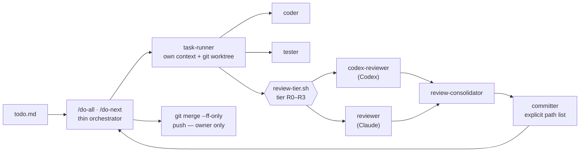

# agent-pipeline

**A Claude Code skill that sets up an autonomous task pipeline in any repository: task queue → isolated runner → risk-based review → commit. No auto-push, no surprises.**

```
/agent-pipeline init      set up the pipeline in a repository
/agent-pipeline upgrade   update an existing (or hand-built) .claude/** setup
/agent-pipeline audit     check an existing pipeline against the principles — report only
```

After `init`, your repository gets the `/do-all`, `/do-next` and `/status` commands: you write tasks as lines in `todo.md`, the pipeline works through them one at a time and returns a short report for each.

## Why

A long autonomous Claude Code session keeps hitting the same problems: the main session's context balloons by hundreds of thousands of tokens, review is either missing or equally expensive for a typo and a database migration, every agent writes to the bookkeeping files, and a single bad `git push` or `git add .` costs more than all the work it saved.

This pipeline grew out of six months of runs in two production repositories and rests on five principles:

1. **One task — one context and one git worktree.** The main session stays a thin loop and grows by 1–2K tokens per task.
2. **State lives in files, not in context**: `todo.md`, `claude-progress.md`, `blockers.md`, git. Context is disposable at any moment.
3. **Save tokens through isolation, not by skipping checks.** Heavy work goes to a subagent with a fresh context; only a short verdict comes back.
4. **The writer is never the reviewer, and review depth follows the risk of the diff.** A script decides the tier — not an agent's gut feeling.
5. **Subagent reports are short and follow a fixed format.**

The details, including what each violation has cost, are in [reference/principles.md](reference/principles.md).

## How it works



The review tier is computed from the task's diff:

| Tier   | What lands here                                                          | Review in the`standard` profile                  |
| ------ | ------------------------------------------------------------------------ | -------------------------------------------------- |
| `R0` | bookkeeping and small doc edits                                          | no review                                          |
| `R1` | docs; code ≤ 2 files and ≤ 60 lines                                    | Codex → fix verification                          |
| `R2` | all other code                                                           | Codex → fix verification                          |
| `R3` | critical paths: money, access, schema, migrations, deploy,`.claude/**` | Codex ‖ Claude + consolidator → fix verification |

The `strict` and `light` profiles shift this scale up or down. Round 2 happens only when serious findings (S1/S2) are confirmed, and it is final — there is no third pass. Minor findings (S3/S4) never spawn new tasks: they are fixed in place or collected into a `CHORES-<block>` task.

## Features

- **A mandatory interview instead of defaults.** Five questions (critical paths, who reviews, strictness, executor models, docs and UI), each with pros and cons for every option and a recommendation for your project based on what reconnaissance found.
- **Codex as the primary reviewer** via the [`openai/codex-plugin-cc`](https://github.com/openai/codex-plugin-cc) plugin: review runs on your ChatGPT subscription and does not consume your Claude limit. If Codex is unavailable, the Claude reviewer takes its role in the same mode — the pipeline does not stop.
- **Models that do not go stale.** Defaults (today: Claude Opus 5.5 for the executors and the Claude reviewer, Fable as the fallback, Codex `gpt-6-sol` at `high`, `xhigh` on critical paths) are re-checked on every `init`/`upgrade`/`audit` against your local Codex catalog and Anthropic's official pages; the deployed pipeline prints `MODEL_WARN` when Codex marks the review model as older or retiring.
- **Tool installation by consent.** If the Codex plugin, the Codex CLI or rembg is missing, the skill shows the exact commands, asks, and installs only what you tick. Nothing is ever installed silently.
- **Assets for UI projects** (optional): image generation through the Codex CLI with the `codex-image.sh` wrapper, and background removal through the [rembg](https://github.com/croef/rembg-mcp) MCP server.
- **`AGENTS.md` as the shared source of rules.** `CLAUDE.md` imports it with an `@AGENTS.md` line and Codex reads it natively — project rules live in one place for every agent.
- **Speaks your language.** Everything ships in English. The skill talks to you in the language you write in, and detects the language of your repository (docs, state files, commit messages) to write the generated prompts and sections in it — it asks only when the signals disagree.
- **`upgrade` mode** updates an already deployed or hand-built `.claude/**`: a legacy copy is made before any write, project-specific blocks are carried over, and no file of yours without a template counterpart is touched.
- **`audit` mode** — 17 checks against the principles, report only.
- **Safety hooks**: blocking of `git push`, `reset --hard`, `rm -rf`, and reads of `.env*` and key files; a ban on background pipeline agents; a context snapshot before compaction.
- **Everything is tested**: seven test matrices for hooks and scripts, which also run inside your repository after installation.

## Requirements

- [Claude Code](https://claude.com/claude-code); `git`, `jq`, `python3`.
- macOS or Linux (the scripts are bash; not tested on Windows).
- For Codex review: `node` ≥ 18.18, the `codex@openai-codex` plugin, and the Codex CLI logged in (a ChatGPT subscription works). Without Codex, the pipeline runs on the Claude reviewer.
- Optional: the Codex `image_generation` feature and the `rembg` MCP server (Python ≥ 3.10) — for the Assets block.

The skill offers to install whatever is missing; `codex login` is always left to you. Detection and installation commands are in [reference/tools.md](reference/tools.md).

## Installation

```bash
git clone https://github.com/makeaiwork/agent-pipeline.git ~/agent-pipeline-skill
ln -s ~/agent-pipeline-skill ~/.claude/skills/agent-pipeline
```

Restart Claude Code — the skill appears as `/agent-pipeline`. Use a symlink, not a copy: `upgrade` identifies the skill version by the git revision of this directory.

## Quick start

In a repository that has at least one commit and no `.claude/agents` yet:

```
/agent-pipeline init
```

1. **Reconnaissance** — stack, commands, critical paths, docs, environment; the result is one "found → proposed" table.
2. **Tools** — an offer to install what is missing (you can decline).
3. **Interview** — five mandatory questions, plus optional ones where reconnaissance was unsure.
4. **Generation** — `.claude/**`, sections in `CLAUDE.md` and `AGENTS.md`, starter state files. Existing files are never overwritten: `settings.json` is merged, the others get a section appended.
5. **Verification and report** — test matrices, hooks, worktree, placeholders; a list of what is left for you to do.

The skill itself commits nothing and runs nothing. Commit the result, restart the session, and try the pipeline on the training task:

```
/do-next SMOKE-1
```

From there on: tasks as lines in `todo.md`, and `/do-all`.

## What lands in your repository

```
.claude/
  agents/      task-runner, researcher, architect, coder, tester, reviewer,
               codex-reviewer, review-consolidator, committer
  skills/      do-all, do-next, status
  scripts/     review-tier.sh, codex-review.sh, codex-image.sh,
               active-session.sh, task-commit.sh (+ tests)
  hooks/       safety-check, agent-sync-check, codex-prompt-write-guard,
               post-edit, pre-compact, session-start-compact, notify (+ tests)
  settings.json
CLAUDE.md      pipeline section + @AGENTS.md import
AGENTS.md      project snapshot, commands, invariants, safety rules
todo.md · claude-progress.md · blockers.md
docs/agent-pipeline-principles.md
.worktreeinclude · lines in .gitignore
```

## What the skill does not do

- It does not push or commit: committing the result of `init`/`upgrade` is yours; inside the pipeline only `committer` commits, by an explicit path list, and `git push` is blocked by a hook.
- It does not overwrite your files and does not touch `.env*`, `.git/config` or `settings.local.json`.
- It installs nothing outside the repository without explicit consent.
- It does not skip the interview — not even on "just do what you think is best": in that case the recommended options are shown and you confirm them.

## Repository layout

```
SKILL.md                 the init | upgrade | audit procedure
reference/principles.md  the why: principles, roles, tiers, anti-patterns, what was deliberately left out
reference/knobs.md       interview matrix: options, pros/cons, defaults, recommendation rules
reference/tools.md       owner's tools: detection and installation by consent
reference/upgrade.md     upgrade mode: file classes, merging, migration table
reference/verify.md      verification checklist after init and upgrade
templates/               everything that lands in the target repository
```

`{{NAME}}` placeholders in `.md` files and `# === PROJECT-SPECIFIC (agent-pipeline init) ===` blocks in `.sh` files are everything `init` substitutes; the full list with defaults is in [reference/knobs.md](reference/knobs.md) §C.

## Development

```bash
for t in templates/claude/hooks/*.test.sh templates/claude/scripts/*.test.sh; do bash "$t"; done
grep -rhno '{{[A-Z_]*}}' templates/ | sort -u           # every placeholder is described in knobs.md
grep -rn -iE '<source repository names>' templates/     # empty: no project names in the templates
```

The rule for porting changes from live repositories: a rule or a command goes into a template; an incident and its numbers go into `reference/principles.md`; project specifics go into a placeholder plus a row in `knobs.md`. After any change, run the tests above and an R3-grade review (`reviewer` ‖ `codex-reviewer`, cwd = this repository).

## Limitations and roadmap

- Translation into a non-English pipeline language is done by the model at install time, not shipped as ready-made locales; scripts, hooks and contract strings (`[MANUAL]`, `[review: Rn]`, `### Verdict:`) stay English in every language.
- The queue is plain lines in `todo.md`; a structured task board is planned.
- Native `AGENTS.md` reading in Claude Code (since 2.1.277) only kicks in when there is no `CLAUDE.md`, so the pipeline keeps an explicit import — it works on any version.

## License

[MIT](LICENSE)
